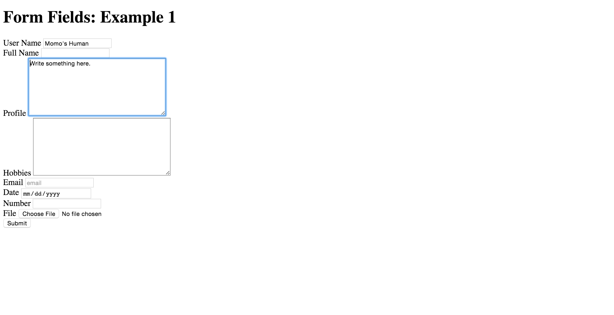

<<<<<<< HEAD
## Basic HTML

Write the HTML necessary to match the mockup images. It does not need to be pixel perfect (just eyeball it) but it should be close, with font, layout, and spacing properly accounted for.  Feel free to use CSS to match the mockup as close as you can.

Boilerplate code:

```html
<!DOCTYPE html>
<html>
  <head>
    <meta charset="UTF-8">
    <title></title>
   </head>
   <body>

   </body>
</html>
```
=======
# HTML forms and form elements

## Resources

- http://www.w3.org/TR/html401/interact/forms.html
- https://developer.mozilla.org/en-US/docs/Web/Guide/HTML/Forms/My_first_HTML_form
- https://developer.mozilla.org/en-US/docs/Web/Guide/HTML/Forms
- https://developer.mozilla.org/en-US/docs/Web/HTML/Element/Input
- http://diveintohtml5.info/forms.html

## Exercise #1

Inside the form in `index.html` add some fields:

- add two inputs with the type "text"
  - give one a value
- add two textareas
  - give one some pre-filled text
- add an input of type "email"
- add an input of type "date"
- add an input of type "number"
- add an input of type "file"
- for each input and textarea, add a label with a `for` attribute that matches
- add unique names and ids to each
- make one of the text fields have focus when the page loads
- give one of the fields some placeholder text
- add a submit button (input with a type of submit)
  - submit the form and inspect the results

  
  
>>>>>>> a6efbd65604e07837918b1d147c6a205bf24244e
